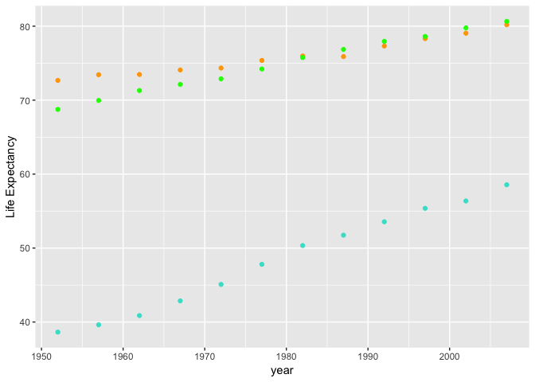

Hw04
================
Vetle Birkeland Huglen
4 10 2018

``` r
library(gapminder)
library(tidyverse)
```

    ## -- Attaching packages --------------------------------------------------- tidyverse 1.2.1 --

    ## <U+221A> ggplot2 3.0.0     <U+221A> purrr   0.2.4
    ## <U+221A> tibble  1.4.1     <U+221A> dplyr   0.7.4
    ## <U+221A> tidyr   0.8.0     <U+221A> stringr 1.2.0
    ## <U+221A> readr   1.1.1     <U+221A> forcats 0.3.0

    ## Warning: package 'ggplot2' was built under R version 3.4.4

    ## -- Conflicts ------------------------------------------------------ tidyverse_conflicts() --
    ## x dplyr::filter() masks stats::filter()
    ## x dplyr::lag()    masks stats::lag()

``` r
compareLifeExp <- gapminder %>% 
  select(year, country, lifeExp) %>%
  filter(country == 'Norway' | country == 'Canada' | country == 'Sudan') %>%
  group_by(year) %>%
  spread(key = country, value=lifeExp)
```

    ## Warning: package 'bindrcpp' was built under R version 3.4.4

``` r
knitr::kable(compareLifeExp)
```

|  year|  Canada|  Norway|   Sudan|
|-----:|-------:|-------:|-------:|
|  1952|  68.750|  72.670|  38.635|
|  1957|  69.960|  73.440|  39.624|
|  1962|  71.300|  73.470|  40.870|
|  1967|  72.130|  74.080|  42.858|
|  1972|  72.880|  74.340|  45.083|
|  1977|  74.210|  75.370|  47.800|
|  1982|  75.760|  75.970|  50.338|
|  1987|  76.860|  75.890|  51.744|
|  1992|  77.950|  77.320|  53.556|
|  1997|  78.610|  78.320|  55.373|
|  2002|  79.770|  79.050|  56.369|
|  2007|  80.653|  80.196|  58.556|

``` r
compareLifeExp %>%
  ggplot() +
  geom_point(aes(year, Norway), colour = 'Orange') +
  geom_point(aes(year, Canada), colour = 'Green') +
  geom_point(aes(year, Sudan), colour = 'Turquoise') +
  labs(y = "Life Expectancy")
```


