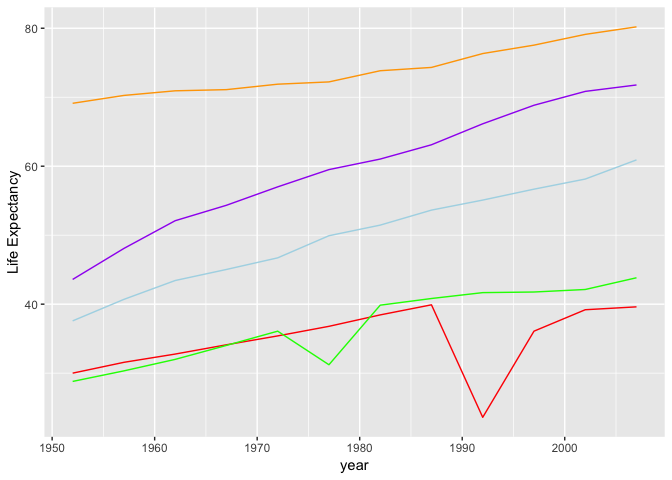
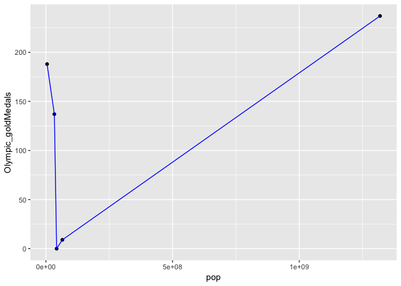
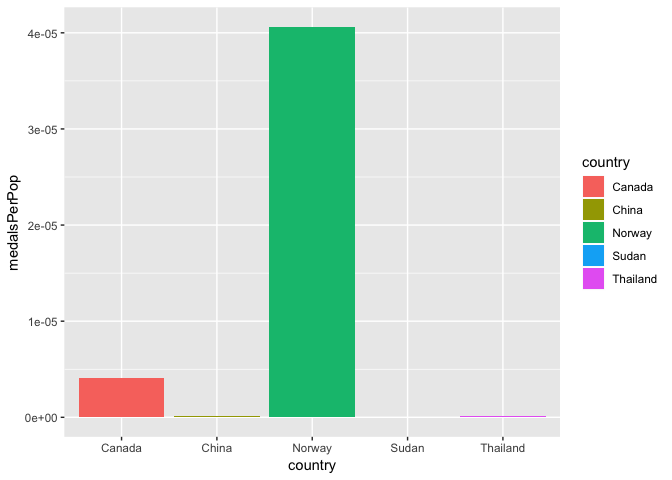

Hw04
================
Vetle Birkeland Huglen
4 10 2018

``` r
library(gapminder)
library(tidyverse)
```

    ## -- Attaching packages ------------------------------------------------------------------ tidyverse 1.2.1 --

    ## <U+221A> ggplot2 3.0.0     <U+221A> purrr   0.2.4
    ## <U+221A> tibble  1.4.1     <U+221A> dplyr   0.7.4
    ## <U+221A> tidyr   0.8.0     <U+221A> stringr 1.2.0
    ## <U+221A> readr   1.1.1     <U+221A> forcats 0.3.0

    ## Warning: package 'ggplot2' was built under R version 3.4.4

    ## -- Conflicts --------------------------------------------------------------------- tidyverse_conflicts() --
    ## x dplyr::filter() masks stats::filter()
    ## x dplyr::lag()    masks stats::lag()

TASK 1 - TIDY DATA
------------------

Here follows a table and a graph visualising life expectancy by year in Norway, Canada and Sudan.

``` r
compareLifeExp <- gapminder %>% 
  select(year, country, lifeExp) %>%
  filter(country == 'Norway' | country == 'Canada' | country == 'Sudan') %>%
  group_by(year) %>%
  spread(key = country, value=lifeExp)
```

    ## Warning: package 'bindrcpp' was built under R version 3.4.4

``` r
knitr::kable(compareLifeExp)
```

|  year|  Canada|  Norway|   Sudan|
|-----:|-------:|-------:|-------:|
|  1952|  68.750|  72.670|  38.635|
|  1957|  69.960|  73.440|  39.624|
|  1962|  71.300|  73.470|  40.870|
|  1967|  72.130|  74.080|  42.858|
|  1972|  72.880|  74.340|  45.083|
|  1977|  74.210|  75.370|  47.800|
|  1982|  75.760|  75.970|  50.338|
|  1987|  76.860|  75.890|  51.744|
|  1992|  77.950|  77.320|  53.556|
|  1997|  78.610|  78.320|  55.373|
|  2002|  79.770|  79.050|  56.369|
|  2007|  80.653|  80.196|  58.556|

``` r
compareLifeExp %>%
  ggplot() +
  geom_point(aes(year, Norway), colour = 'Orange') +
  geom_point(aes(year, Canada), colour = 'Green') +
  geom_point(aes(year, Sudan), colour = 'Turquoise') +
  labs(y = "Life Expectancy")
```


Now lets look at the smallest life expectancy in each continent by year.

``` r
minLifeExp <- gapminder %>%
  group_by(year, continent) %>%
  summarise(min_lifeExp = min(lifeExp)) %>%
  spread(key = continent, value = min_lifeExp)
knitr::kable(minLifeExp)
```

|  year|  Africa|  Americas|    Asia|  Europe|  Oceania|
|-----:|-------:|---------:|-------:|-------:|--------:|
|  1952|  30.000|    37.579|  28.801|  43.585|   69.120|
|  1957|  31.570|    40.696|  30.332|  48.079|   70.260|
|  1962|  32.767|    43.428|  31.997|  52.098|   70.930|
|  1967|  34.113|    45.032|  34.020|  54.336|   71.100|
|  1972|  35.400|    46.714|  36.088|  57.005|   71.890|
|  1977|  36.788|    49.923|  31.220|  59.507|   72.220|
|  1982|  38.445|    51.461|  39.854|  61.036|   73.840|
|  1987|  39.906|    53.636|  40.822|  63.108|   74.320|
|  1992|  23.599|    55.089|  41.674|  66.146|   76.330|
|  1997|  36.087|    56.671|  41.763|  68.835|   77.550|
|  2002|  39.193|    58.137|  42.129|  70.845|   79.110|
|  2007|  39.613|    60.916|  43.828|  71.777|   80.204|

Like in the plot in the first task, this form makes it easy to make plots that compare the different continents, since we have already divided them into seperate features. Lets make a line plot to get some variety:

``` r
minLifeExp %>% 
  ggplot() +
  geom_line(aes(year, Africa), colour = 'red') +
  geom_line(aes(year, Asia), colour = 'green') +
  geom_line(aes(year, Europe), colour = 'purple') +
  geom_line(aes(year, Americas), colour = 'light blue') +
  geom_line(aes(year, Oceania), colour = 'orange') +
  labs(y = "Life Expectancy")
```



Here I'll create a new dataframe with some additional information about some selected countries, and join them to the year 2007 in gapminder, as that is roughly the same time as the olympic medal statistic is from:

``` r
more_data <- data_frame(country = c('Norway', 'Canada', 'Sudan', 'China', 'Thailand'), highest_peak = c(2469, 5956, 3042, 8848, 2565), Olympic_goldMedals = c(188, 137, 0, 237, 9))

joined_data <- gapminder %>%
  filter(year == 2007) %>%
  right_join(more_data, by = 'country')
```

    ## Warning: Column `country` joining factor and character vector, coercing
    ## into character vector

``` r
knitr::kable(joined_data)
```

| country  | continent |  year|  lifeExp|         pop|  gdpPercap|  highest\_peak|  Olympic\_goldMedals|
|:---------|:----------|-----:|--------:|-----------:|----------:|--------------:|--------------------:|
| Norway   | Europe    |  2007|   80.196|     4627926|  49357.190|           2469|                  188|
| Canada   | Americas  |  2007|   80.653|    33390141|  36319.235|           5956|                  137|
| Sudan    | Africa    |  2007|   58.556|    42292929|   2602.395|           3042|                    0|
| China    | Asia      |  2007|   72.961|  1318683096|   4959.115|           8848|                  237|
| Thailand | Asia      |  2007|   70.616|    65068149|   7458.396|           2565|                    9|

Lets see if we can get different results using different joins:

``` r
left_join <- gapminder %>%
  filter(year == 2007) %>%
  left_join(more_data, by = 'country')
```

    ## Warning: Column `country` joining factor and character vector, coercing
    ## into character vector

``` r
knitr::kable(left_join)
```

| country                  | continent |  year|  lifeExp|         pop|   gdpPercap|  highest\_peak|  Olympic\_goldMedals|
|:-------------------------|:----------|-----:|--------:|-----------:|-----------:|--------------:|--------------------:|
| Afghanistan              | Asia      |  2007|   43.828|    31889923|    974.5803|             NA|                   NA|
| Albania                  | Europe    |  2007|   76.423|     3600523|   5937.0295|             NA|                   NA|
| Algeria                  | Africa    |  2007|   72.301|    33333216|   6223.3675|             NA|                   NA|
| Angola                   | Africa    |  2007|   42.731|    12420476|   4797.2313|             NA|                   NA|
| Argentina                | Americas  |  2007|   75.320|    40301927|  12779.3796|             NA|                   NA|
| Australia                | Oceania   |  2007|   81.235|    20434176|  34435.3674|             NA|                   NA|
| Austria                  | Europe    |  2007|   79.829|     8199783|  36126.4927|             NA|                   NA|
| Bahrain                  | Asia      |  2007|   75.635|      708573|  29796.0483|             NA|                   NA|
| Bangladesh               | Asia      |  2007|   64.062|   150448339|   1391.2538|             NA|                   NA|
| Belgium                  | Europe    |  2007|   79.441|    10392226|  33692.6051|             NA|                   NA|
| Benin                    | Africa    |  2007|   56.728|     8078314|   1441.2849|             NA|                   NA|
| Bolivia                  | Americas  |  2007|   65.554|     9119152|   3822.1371|             NA|                   NA|
| Bosnia and Herzegovina   | Europe    |  2007|   74.852|     4552198|   7446.2988|             NA|                   NA|
| Botswana                 | Africa    |  2007|   50.728|     1639131|  12569.8518|             NA|                   NA|
| Brazil                   | Americas  |  2007|   72.390|   190010647|   9065.8008|             NA|                   NA|
| Bulgaria                 | Europe    |  2007|   73.005|     7322858|  10680.7928|             NA|                   NA|
| Burkina Faso             | Africa    |  2007|   52.295|    14326203|   1217.0330|             NA|                   NA|
| Burundi                  | Africa    |  2007|   49.580|     8390505|    430.0707|             NA|                   NA|
| Cambodia                 | Asia      |  2007|   59.723|    14131858|   1713.7787|             NA|                   NA|
| Cameroon                 | Africa    |  2007|   50.430|    17696293|   2042.0952|             NA|                   NA|
| Canada                   | Americas  |  2007|   80.653|    33390141|  36319.2350|           5956|                  137|
| Central African Republic | Africa    |  2007|   44.741|     4369038|    706.0165|             NA|                   NA|
| Chad                     | Africa    |  2007|   50.651|    10238807|   1704.0637|             NA|                   NA|
| Chile                    | Americas  |  2007|   78.553|    16284741|  13171.6388|             NA|                   NA|
| China                    | Asia      |  2007|   72.961|  1318683096|   4959.1149|           8848|                  237|
| Colombia                 | Americas  |  2007|   72.889|    44227550|   7006.5804|             NA|                   NA|
| Comoros                  | Africa    |  2007|   65.152|      710960|    986.1479|             NA|                   NA|
| Congo, Dem. Rep.         | Africa    |  2007|   46.462|    64606759|    277.5519|             NA|                   NA|
| Congo, Rep.              | Africa    |  2007|   55.322|     3800610|   3632.5578|             NA|                   NA|
| Costa Rica               | Americas  |  2007|   78.782|     4133884|   9645.0614|             NA|                   NA|
| Cote d'Ivoire            | Africa    |  2007|   48.328|    18013409|   1544.7501|             NA|                   NA|
| Croatia                  | Europe    |  2007|   75.748|     4493312|  14619.2227|             NA|                   NA|
| Cuba                     | Americas  |  2007|   78.273|    11416987|   8948.1029|             NA|                   NA|
| Czech Republic           | Europe    |  2007|   76.486|    10228744|  22833.3085|             NA|                   NA|
| Denmark                  | Europe    |  2007|   78.332|     5468120|  35278.4187|             NA|                   NA|
| Djibouti                 | Africa    |  2007|   54.791|      496374|   2082.4816|             NA|                   NA|
| Dominican Republic       | Americas  |  2007|   72.235|     9319622|   6025.3748|             NA|                   NA|
| Ecuador                  | Americas  |  2007|   74.994|    13755680|   6873.2623|             NA|                   NA|
| Egypt                    | Africa    |  2007|   71.338|    80264543|   5581.1810|             NA|                   NA|
| El Salvador              | Americas  |  2007|   71.878|     6939688|   5728.3535|             NA|                   NA|
| Equatorial Guinea        | Africa    |  2007|   51.579|      551201|  12154.0897|             NA|                   NA|
| Eritrea                  | Africa    |  2007|   58.040|     4906585|    641.3695|             NA|                   NA|
| Ethiopia                 | Africa    |  2007|   52.947|    76511887|    690.8056|             NA|                   NA|
| Finland                  | Europe    |  2007|   79.313|     5238460|  33207.0844|             NA|                   NA|
| France                   | Europe    |  2007|   80.657|    61083916|  30470.0167|             NA|                   NA|
| Gabon                    | Africa    |  2007|   56.735|     1454867|  13206.4845|             NA|                   NA|
| Gambia                   | Africa    |  2007|   59.448|     1688359|    752.7497|             NA|                   NA|
| Germany                  | Europe    |  2007|   79.406|    82400996|  32170.3744|             NA|                   NA|
| Ghana                    | Africa    |  2007|   60.022|    22873338|   1327.6089|             NA|                   NA|
| Greece                   | Europe    |  2007|   79.483|    10706290|  27538.4119|             NA|                   NA|
| Guatemala                | Americas  |  2007|   70.259|    12572928|   5186.0500|             NA|                   NA|
| Guinea                   | Africa    |  2007|   56.007|     9947814|    942.6542|             NA|                   NA|
| Guinea-Bissau            | Africa    |  2007|   46.388|     1472041|    579.2317|             NA|                   NA|
| Haiti                    | Americas  |  2007|   60.916|     8502814|   1201.6372|             NA|                   NA|
| Honduras                 | Americas  |  2007|   70.198|     7483763|   3548.3308|             NA|                   NA|
| Hong Kong, China         | Asia      |  2007|   82.208|     6980412|  39724.9787|             NA|                   NA|
| Hungary                  | Europe    |  2007|   73.338|     9956108|  18008.9444|             NA|                   NA|
| Iceland                  | Europe    |  2007|   81.757|      301931|  36180.7892|             NA|                   NA|
| India                    | Asia      |  2007|   64.698|  1110396331|   2452.2104|             NA|                   NA|
| Indonesia                | Asia      |  2007|   70.650|   223547000|   3540.6516|             NA|                   NA|
| Iran                     | Asia      |  2007|   70.964|    69453570|  11605.7145|             NA|                   NA|
| Iraq                     | Asia      |  2007|   59.545|    27499638|   4471.0619|             NA|                   NA|
| Ireland                  | Europe    |  2007|   78.885|     4109086|  40675.9964|             NA|                   NA|
| Israel                   | Asia      |  2007|   80.745|     6426679|  25523.2771|             NA|                   NA|
| Italy                    | Europe    |  2007|   80.546|    58147733|  28569.7197|             NA|                   NA|
| Jamaica                  | Americas  |  2007|   72.567|     2780132|   7320.8803|             NA|                   NA|
| Japan                    | Asia      |  2007|   82.603|   127467972|  31656.0681|             NA|                   NA|
| Jordan                   | Asia      |  2007|   72.535|     6053193|   4519.4612|             NA|                   NA|
| Kenya                    | Africa    |  2007|   54.110|    35610177|   1463.2493|             NA|                   NA|
| Korea, Dem. Rep.         | Asia      |  2007|   67.297|    23301725|   1593.0655|             NA|                   NA|
| Korea, Rep.              | Asia      |  2007|   78.623|    49044790|  23348.1397|             NA|                   NA|
| Kuwait                   | Asia      |  2007|   77.588|     2505559|  47306.9898|             NA|                   NA|
| Lebanon                  | Asia      |  2007|   71.993|     3921278|  10461.0587|             NA|                   NA|
| Lesotho                  | Africa    |  2007|   42.592|     2012649|   1569.3314|             NA|                   NA|
| Liberia                  | Africa    |  2007|   45.678|     3193942|    414.5073|             NA|                   NA|
| Libya                    | Africa    |  2007|   73.952|     6036914|  12057.4993|             NA|                   NA|
| Madagascar               | Africa    |  2007|   59.443|    19167654|   1044.7701|             NA|                   NA|
| Malawi                   | Africa    |  2007|   48.303|    13327079|    759.3499|             NA|                   NA|
| Malaysia                 | Asia      |  2007|   74.241|    24821286|  12451.6558|             NA|                   NA|
| Mali                     | Africa    |  2007|   54.467|    12031795|   1042.5816|             NA|                   NA|
| Mauritania               | Africa    |  2007|   64.164|     3270065|   1803.1515|             NA|                   NA|
| Mauritius                | Africa    |  2007|   72.801|     1250882|  10956.9911|             NA|                   NA|
| Mexico                   | Americas  |  2007|   76.195|   108700891|  11977.5750|             NA|                   NA|
| Mongolia                 | Asia      |  2007|   66.803|     2874127|   3095.7723|             NA|                   NA|
| Montenegro               | Europe    |  2007|   74.543|      684736|   9253.8961|             NA|                   NA|
| Morocco                  | Africa    |  2007|   71.164|    33757175|   3820.1752|             NA|                   NA|
| Mozambique               | Africa    |  2007|   42.082|    19951656|    823.6856|             NA|                   NA|
| Myanmar                  | Asia      |  2007|   62.069|    47761980|    944.0000|             NA|                   NA|
| Namibia                  | Africa    |  2007|   52.906|     2055080|   4811.0604|             NA|                   NA|
| Nepal                    | Asia      |  2007|   63.785|    28901790|   1091.3598|             NA|                   NA|
| Netherlands              | Europe    |  2007|   79.762|    16570613|  36797.9333|             NA|                   NA|
| New Zealand              | Oceania   |  2007|   80.204|     4115771|  25185.0091|             NA|                   NA|
| Nicaragua                | Americas  |  2007|   72.899|     5675356|   2749.3210|             NA|                   NA|
| Niger                    | Africa    |  2007|   56.867|    12894865|    619.6769|             NA|                   NA|
| Nigeria                  | Africa    |  2007|   46.859|   135031164|   2013.9773|             NA|                   NA|
| Norway                   | Europe    |  2007|   80.196|     4627926|  49357.1902|           2469|                  188|
| Oman                     | Asia      |  2007|   75.640|     3204897|  22316.1929|             NA|                   NA|
| Pakistan                 | Asia      |  2007|   65.483|   169270617|   2605.9476|             NA|                   NA|
| Panama                   | Americas  |  2007|   75.537|     3242173|   9809.1856|             NA|                   NA|
| Paraguay                 | Americas  |  2007|   71.752|     6667147|   4172.8385|             NA|                   NA|
| Peru                     | Americas  |  2007|   71.421|    28674757|   7408.9056|             NA|                   NA|
| Philippines              | Asia      |  2007|   71.688|    91077287|   3190.4810|             NA|                   NA|
| Poland                   | Europe    |  2007|   75.563|    38518241|  15389.9247|             NA|                   NA|
| Portugal                 | Europe    |  2007|   78.098|    10642836|  20509.6478|             NA|                   NA|
| Puerto Rico              | Americas  |  2007|   78.746|     3942491|  19328.7090|             NA|                   NA|
| Reunion                  | Africa    |  2007|   76.442|      798094|   7670.1226|             NA|                   NA|
| Romania                  | Europe    |  2007|   72.476|    22276056|  10808.4756|             NA|                   NA|
| Rwanda                   | Africa    |  2007|   46.242|     8860588|    863.0885|             NA|                   NA|
| Sao Tome and Principe    | Africa    |  2007|   65.528|      199579|   1598.4351|             NA|                   NA|
| Saudi Arabia             | Asia      |  2007|   72.777|    27601038|  21654.8319|             NA|                   NA|
| Senegal                  | Africa    |  2007|   63.062|    12267493|   1712.4721|             NA|                   NA|
| Serbia                   | Europe    |  2007|   74.002|    10150265|   9786.5347|             NA|                   NA|
| Sierra Leone             | Africa    |  2007|   42.568|     6144562|    862.5408|             NA|                   NA|
| Singapore                | Asia      |  2007|   79.972|     4553009|  47143.1796|             NA|                   NA|
| Slovak Republic          | Europe    |  2007|   74.663|     5447502|  18678.3144|             NA|                   NA|
| Slovenia                 | Europe    |  2007|   77.926|     2009245|  25768.2576|             NA|                   NA|
| Somalia                  | Africa    |  2007|   48.159|     9118773|    926.1411|             NA|                   NA|
| South Africa             | Africa    |  2007|   49.339|    43997828|   9269.6578|             NA|                   NA|
| Spain                    | Europe    |  2007|   80.941|    40448191|  28821.0637|             NA|                   NA|
| Sri Lanka                | Asia      |  2007|   72.396|    20378239|   3970.0954|             NA|                   NA|
| Sudan                    | Africa    |  2007|   58.556|    42292929|   2602.3950|           3042|                    0|
| Swaziland                | Africa    |  2007|   39.613|     1133066|   4513.4806|             NA|                   NA|
| Sweden                   | Europe    |  2007|   80.884|     9031088|  33859.7484|             NA|                   NA|
| Switzerland              | Europe    |  2007|   81.701|     7554661|  37506.4191|             NA|                   NA|
| Syria                    | Asia      |  2007|   74.143|    19314747|   4184.5481|             NA|                   NA|
| Taiwan                   | Asia      |  2007|   78.400|    23174294|  28718.2768|             NA|                   NA|
| Tanzania                 | Africa    |  2007|   52.517|    38139640|   1107.4822|             NA|                   NA|
| Thailand                 | Asia      |  2007|   70.616|    65068149|   7458.3963|           2565|                    9|
| Togo                     | Africa    |  2007|   58.420|     5701579|    882.9699|             NA|                   NA|
| Trinidad and Tobago      | Americas  |  2007|   69.819|     1056608|  18008.5092|             NA|                   NA|
| Tunisia                  | Africa    |  2007|   73.923|    10276158|   7092.9230|             NA|                   NA|
| Turkey                   | Europe    |  2007|   71.777|    71158647|   8458.2764|             NA|                   NA|
| Uganda                   | Africa    |  2007|   51.542|    29170398|   1056.3801|             NA|                   NA|
| United Kingdom           | Europe    |  2007|   79.425|    60776238|  33203.2613|             NA|                   NA|
| United States            | Americas  |  2007|   78.242|   301139947|  42951.6531|             NA|                   NA|
| Uruguay                  | Americas  |  2007|   76.384|     3447496|  10611.4630|             NA|                   NA|
| Venezuela                | Americas  |  2007|   73.747|    26084662|  11415.8057|             NA|                   NA|
| Vietnam                  | Asia      |  2007|   74.249|    85262356|   2441.5764|             NA|                   NA|
| West Bank and Gaza       | Asia      |  2007|   73.422|     4018332|   3025.3498|             NA|                   NA|
| Yemen, Rep.              | Asia      |  2007|   62.698|    22211743|   2280.7699|             NA|                   NA|
| Zambia                   | Africa    |  2007|   42.384|    11746035|   1271.2116|             NA|                   NA|
| Zimbabwe                 | Africa    |  2007|   43.487|    12311143|    469.7093|             NA|                   NA|

So left\_join will in this example keep all the rows in gapminder, and paste in the more\_data dataset where it fits.

``` r
full_join <- gapminder %>%
  filter(year == 2007) %>%
  full_join(more_data, by = 'country')
```

    ## Warning: Column `country` joining factor and character vector, coercing
    ## into character vector

``` r
knitr::kable(full_join)
```

| country                  | continent |  year|  lifeExp|         pop|   gdpPercap|  highest\_peak|  Olympic\_goldMedals|
|:-------------------------|:----------|-----:|--------:|-----------:|-----------:|--------------:|--------------------:|
| Afghanistan              | Asia      |  2007|   43.828|    31889923|    974.5803|             NA|                   NA|
| Albania                  | Europe    |  2007|   76.423|     3600523|   5937.0295|             NA|                   NA|
| Algeria                  | Africa    |  2007|   72.301|    33333216|   6223.3675|             NA|                   NA|
| Angola                   | Africa    |  2007|   42.731|    12420476|   4797.2313|             NA|                   NA|
| Argentina                | Americas  |  2007|   75.320|    40301927|  12779.3796|             NA|                   NA|
| Australia                | Oceania   |  2007|   81.235|    20434176|  34435.3674|             NA|                   NA|
| Austria                  | Europe    |  2007|   79.829|     8199783|  36126.4927|             NA|                   NA|
| Bahrain                  | Asia      |  2007|   75.635|      708573|  29796.0483|             NA|                   NA|
| Bangladesh               | Asia      |  2007|   64.062|   150448339|   1391.2538|             NA|                   NA|
| Belgium                  | Europe    |  2007|   79.441|    10392226|  33692.6051|             NA|                   NA|
| Benin                    | Africa    |  2007|   56.728|     8078314|   1441.2849|             NA|                   NA|
| Bolivia                  | Americas  |  2007|   65.554|     9119152|   3822.1371|             NA|                   NA|
| Bosnia and Herzegovina   | Europe    |  2007|   74.852|     4552198|   7446.2988|             NA|                   NA|
| Botswana                 | Africa    |  2007|   50.728|     1639131|  12569.8518|             NA|                   NA|
| Brazil                   | Americas  |  2007|   72.390|   190010647|   9065.8008|             NA|                   NA|
| Bulgaria                 | Europe    |  2007|   73.005|     7322858|  10680.7928|             NA|                   NA|
| Burkina Faso             | Africa    |  2007|   52.295|    14326203|   1217.0330|             NA|                   NA|
| Burundi                  | Africa    |  2007|   49.580|     8390505|    430.0707|             NA|                   NA|
| Cambodia                 | Asia      |  2007|   59.723|    14131858|   1713.7787|             NA|                   NA|
| Cameroon                 | Africa    |  2007|   50.430|    17696293|   2042.0952|             NA|                   NA|
| Canada                   | Americas  |  2007|   80.653|    33390141|  36319.2350|           5956|                  137|
| Central African Republic | Africa    |  2007|   44.741|     4369038|    706.0165|             NA|                   NA|
| Chad                     | Africa    |  2007|   50.651|    10238807|   1704.0637|             NA|                   NA|
| Chile                    | Americas  |  2007|   78.553|    16284741|  13171.6388|             NA|                   NA|
| China                    | Asia      |  2007|   72.961|  1318683096|   4959.1149|           8848|                  237|
| Colombia                 | Americas  |  2007|   72.889|    44227550|   7006.5804|             NA|                   NA|
| Comoros                  | Africa    |  2007|   65.152|      710960|    986.1479|             NA|                   NA|
| Congo, Dem. Rep.         | Africa    |  2007|   46.462|    64606759|    277.5519|             NA|                   NA|
| Congo, Rep.              | Africa    |  2007|   55.322|     3800610|   3632.5578|             NA|                   NA|
| Costa Rica               | Americas  |  2007|   78.782|     4133884|   9645.0614|             NA|                   NA|
| Cote d'Ivoire            | Africa    |  2007|   48.328|    18013409|   1544.7501|             NA|                   NA|
| Croatia                  | Europe    |  2007|   75.748|     4493312|  14619.2227|             NA|                   NA|
| Cuba                     | Americas  |  2007|   78.273|    11416987|   8948.1029|             NA|                   NA|
| Czech Republic           | Europe    |  2007|   76.486|    10228744|  22833.3085|             NA|                   NA|
| Denmark                  | Europe    |  2007|   78.332|     5468120|  35278.4187|             NA|                   NA|
| Djibouti                 | Africa    |  2007|   54.791|      496374|   2082.4816|             NA|                   NA|
| Dominican Republic       | Americas  |  2007|   72.235|     9319622|   6025.3748|             NA|                   NA|
| Ecuador                  | Americas  |  2007|   74.994|    13755680|   6873.2623|             NA|                   NA|
| Egypt                    | Africa    |  2007|   71.338|    80264543|   5581.1810|             NA|                   NA|
| El Salvador              | Americas  |  2007|   71.878|     6939688|   5728.3535|             NA|                   NA|
| Equatorial Guinea        | Africa    |  2007|   51.579|      551201|  12154.0897|             NA|                   NA|
| Eritrea                  | Africa    |  2007|   58.040|     4906585|    641.3695|             NA|                   NA|
| Ethiopia                 | Africa    |  2007|   52.947|    76511887|    690.8056|             NA|                   NA|
| Finland                  | Europe    |  2007|   79.313|     5238460|  33207.0844|             NA|                   NA|
| France                   | Europe    |  2007|   80.657|    61083916|  30470.0167|             NA|                   NA|
| Gabon                    | Africa    |  2007|   56.735|     1454867|  13206.4845|             NA|                   NA|
| Gambia                   | Africa    |  2007|   59.448|     1688359|    752.7497|             NA|                   NA|
| Germany                  | Europe    |  2007|   79.406|    82400996|  32170.3744|             NA|                   NA|
| Ghana                    | Africa    |  2007|   60.022|    22873338|   1327.6089|             NA|                   NA|
| Greece                   | Europe    |  2007|   79.483|    10706290|  27538.4119|             NA|                   NA|
| Guatemala                | Americas  |  2007|   70.259|    12572928|   5186.0500|             NA|                   NA|
| Guinea                   | Africa    |  2007|   56.007|     9947814|    942.6542|             NA|                   NA|
| Guinea-Bissau            | Africa    |  2007|   46.388|     1472041|    579.2317|             NA|                   NA|
| Haiti                    | Americas  |  2007|   60.916|     8502814|   1201.6372|             NA|                   NA|
| Honduras                 | Americas  |  2007|   70.198|     7483763|   3548.3308|             NA|                   NA|
| Hong Kong, China         | Asia      |  2007|   82.208|     6980412|  39724.9787|             NA|                   NA|
| Hungary                  | Europe    |  2007|   73.338|     9956108|  18008.9444|             NA|                   NA|
| Iceland                  | Europe    |  2007|   81.757|      301931|  36180.7892|             NA|                   NA|
| India                    | Asia      |  2007|   64.698|  1110396331|   2452.2104|             NA|                   NA|
| Indonesia                | Asia      |  2007|   70.650|   223547000|   3540.6516|             NA|                   NA|
| Iran                     | Asia      |  2007|   70.964|    69453570|  11605.7145|             NA|                   NA|
| Iraq                     | Asia      |  2007|   59.545|    27499638|   4471.0619|             NA|                   NA|
| Ireland                  | Europe    |  2007|   78.885|     4109086|  40675.9964|             NA|                   NA|
| Israel                   | Asia      |  2007|   80.745|     6426679|  25523.2771|             NA|                   NA|
| Italy                    | Europe    |  2007|   80.546|    58147733|  28569.7197|             NA|                   NA|
| Jamaica                  | Americas  |  2007|   72.567|     2780132|   7320.8803|             NA|                   NA|
| Japan                    | Asia      |  2007|   82.603|   127467972|  31656.0681|             NA|                   NA|
| Jordan                   | Asia      |  2007|   72.535|     6053193|   4519.4612|             NA|                   NA|
| Kenya                    | Africa    |  2007|   54.110|    35610177|   1463.2493|             NA|                   NA|
| Korea, Dem. Rep.         | Asia      |  2007|   67.297|    23301725|   1593.0655|             NA|                   NA|
| Korea, Rep.              | Asia      |  2007|   78.623|    49044790|  23348.1397|             NA|                   NA|
| Kuwait                   | Asia      |  2007|   77.588|     2505559|  47306.9898|             NA|                   NA|
| Lebanon                  | Asia      |  2007|   71.993|     3921278|  10461.0587|             NA|                   NA|
| Lesotho                  | Africa    |  2007|   42.592|     2012649|   1569.3314|             NA|                   NA|
| Liberia                  | Africa    |  2007|   45.678|     3193942|    414.5073|             NA|                   NA|
| Libya                    | Africa    |  2007|   73.952|     6036914|  12057.4993|             NA|                   NA|
| Madagascar               | Africa    |  2007|   59.443|    19167654|   1044.7701|             NA|                   NA|
| Malawi                   | Africa    |  2007|   48.303|    13327079|    759.3499|             NA|                   NA|
| Malaysia                 | Asia      |  2007|   74.241|    24821286|  12451.6558|             NA|                   NA|
| Mali                     | Africa    |  2007|   54.467|    12031795|   1042.5816|             NA|                   NA|
| Mauritania               | Africa    |  2007|   64.164|     3270065|   1803.1515|             NA|                   NA|
| Mauritius                | Africa    |  2007|   72.801|     1250882|  10956.9911|             NA|                   NA|
| Mexico                   | Americas  |  2007|   76.195|   108700891|  11977.5750|             NA|                   NA|
| Mongolia                 | Asia      |  2007|   66.803|     2874127|   3095.7723|             NA|                   NA|
| Montenegro               | Europe    |  2007|   74.543|      684736|   9253.8961|             NA|                   NA|
| Morocco                  | Africa    |  2007|   71.164|    33757175|   3820.1752|             NA|                   NA|
| Mozambique               | Africa    |  2007|   42.082|    19951656|    823.6856|             NA|                   NA|
| Myanmar                  | Asia      |  2007|   62.069|    47761980|    944.0000|             NA|                   NA|
| Namibia                  | Africa    |  2007|   52.906|     2055080|   4811.0604|             NA|                   NA|
| Nepal                    | Asia      |  2007|   63.785|    28901790|   1091.3598|             NA|                   NA|
| Netherlands              | Europe    |  2007|   79.762|    16570613|  36797.9333|             NA|                   NA|
| New Zealand              | Oceania   |  2007|   80.204|     4115771|  25185.0091|             NA|                   NA|
| Nicaragua                | Americas  |  2007|   72.899|     5675356|   2749.3210|             NA|                   NA|
| Niger                    | Africa    |  2007|   56.867|    12894865|    619.6769|             NA|                   NA|
| Nigeria                  | Africa    |  2007|   46.859|   135031164|   2013.9773|             NA|                   NA|
| Norway                   | Europe    |  2007|   80.196|     4627926|  49357.1902|           2469|                  188|
| Oman                     | Asia      |  2007|   75.640|     3204897|  22316.1929|             NA|                   NA|
| Pakistan                 | Asia      |  2007|   65.483|   169270617|   2605.9476|             NA|                   NA|
| Panama                   | Americas  |  2007|   75.537|     3242173|   9809.1856|             NA|                   NA|
| Paraguay                 | Americas  |  2007|   71.752|     6667147|   4172.8385|             NA|                   NA|
| Peru                     | Americas  |  2007|   71.421|    28674757|   7408.9056|             NA|                   NA|
| Philippines              | Asia      |  2007|   71.688|    91077287|   3190.4810|             NA|                   NA|
| Poland                   | Europe    |  2007|   75.563|    38518241|  15389.9247|             NA|                   NA|
| Portugal                 | Europe    |  2007|   78.098|    10642836|  20509.6478|             NA|                   NA|
| Puerto Rico              | Americas  |  2007|   78.746|     3942491|  19328.7090|             NA|                   NA|
| Reunion                  | Africa    |  2007|   76.442|      798094|   7670.1226|             NA|                   NA|
| Romania                  | Europe    |  2007|   72.476|    22276056|  10808.4756|             NA|                   NA|
| Rwanda                   | Africa    |  2007|   46.242|     8860588|    863.0885|             NA|                   NA|
| Sao Tome and Principe    | Africa    |  2007|   65.528|      199579|   1598.4351|             NA|                   NA|
| Saudi Arabia             | Asia      |  2007|   72.777|    27601038|  21654.8319|             NA|                   NA|
| Senegal                  | Africa    |  2007|   63.062|    12267493|   1712.4721|             NA|                   NA|
| Serbia                   | Europe    |  2007|   74.002|    10150265|   9786.5347|             NA|                   NA|
| Sierra Leone             | Africa    |  2007|   42.568|     6144562|    862.5408|             NA|                   NA|
| Singapore                | Asia      |  2007|   79.972|     4553009|  47143.1796|             NA|                   NA|
| Slovak Republic          | Europe    |  2007|   74.663|     5447502|  18678.3144|             NA|                   NA|
| Slovenia                 | Europe    |  2007|   77.926|     2009245|  25768.2576|             NA|                   NA|
| Somalia                  | Africa    |  2007|   48.159|     9118773|    926.1411|             NA|                   NA|
| South Africa             | Africa    |  2007|   49.339|    43997828|   9269.6578|             NA|                   NA|
| Spain                    | Europe    |  2007|   80.941|    40448191|  28821.0637|             NA|                   NA|
| Sri Lanka                | Asia      |  2007|   72.396|    20378239|   3970.0954|             NA|                   NA|
| Sudan                    | Africa    |  2007|   58.556|    42292929|   2602.3950|           3042|                    0|
| Swaziland                | Africa    |  2007|   39.613|     1133066|   4513.4806|             NA|                   NA|
| Sweden                   | Europe    |  2007|   80.884|     9031088|  33859.7484|             NA|                   NA|
| Switzerland              | Europe    |  2007|   81.701|     7554661|  37506.4191|             NA|                   NA|
| Syria                    | Asia      |  2007|   74.143|    19314747|   4184.5481|             NA|                   NA|
| Taiwan                   | Asia      |  2007|   78.400|    23174294|  28718.2768|             NA|                   NA|
| Tanzania                 | Africa    |  2007|   52.517|    38139640|   1107.4822|             NA|                   NA|
| Thailand                 | Asia      |  2007|   70.616|    65068149|   7458.3963|           2565|                    9|
| Togo                     | Africa    |  2007|   58.420|     5701579|    882.9699|             NA|                   NA|
| Trinidad and Tobago      | Americas  |  2007|   69.819|     1056608|  18008.5092|             NA|                   NA|
| Tunisia                  | Africa    |  2007|   73.923|    10276158|   7092.9230|             NA|                   NA|
| Turkey                   | Europe    |  2007|   71.777|    71158647|   8458.2764|             NA|                   NA|
| Uganda                   | Africa    |  2007|   51.542|    29170398|   1056.3801|             NA|                   NA|
| United Kingdom           | Europe    |  2007|   79.425|    60776238|  33203.2613|             NA|                   NA|
| United States            | Americas  |  2007|   78.242|   301139947|  42951.6531|             NA|                   NA|
| Uruguay                  | Americas  |  2007|   76.384|     3447496|  10611.4630|             NA|                   NA|
| Venezuela                | Americas  |  2007|   73.747|    26084662|  11415.8057|             NA|                   NA|
| Vietnam                  | Asia      |  2007|   74.249|    85262356|   2441.5764|             NA|                   NA|
| West Bank and Gaza       | Asia      |  2007|   73.422|     4018332|   3025.3498|             NA|                   NA|
| Yemen, Rep.              | Asia      |  2007|   62.698|    22211743|   2280.7699|             NA|                   NA|
| Zambia                   | Africa    |  2007|   42.384|    11746035|   1271.2116|             NA|                   NA|
| Zimbabwe                 | Africa    |  2007|   43.487|    12311143|    469.7093|             NA|                   NA|

Actually, full\_join does exactly the same as left\_join on this data set. This is because all the countries present in more\_data dataset, are also present in the original gapminder. Therefore, we should also see that inner\_join will replicate the result of the right\_join we started with:

``` r
inner_join <- gapminder %>%
  filter(year == 2007) %>%
  inner_join(more_data, by = 'country')
```

    ## Warning: Column `country` joining factor and character vector, coercing
    ## into character vector

``` r
knitr::kable(inner_join)
```

| country  | continent |  year|  lifeExp|         pop|  gdpPercap|  highest\_peak|  Olympic\_goldMedals|
|:---------|:----------|-----:|--------:|-----------:|----------:|--------------:|--------------------:|
| Canada   | Americas  |  2007|   80.653|    33390141|  36319.235|           5956|                  137|
| China    | Asia      |  2007|   72.961|  1318683096|   4959.115|           8848|                  237|
| Norway   | Europe    |  2007|   80.196|     4627926|  49357.190|           2469|                  188|
| Sudan    | Africa    |  2007|   58.556|    42292929|   2602.395|           3042|                    0|
| Thailand | Asia      |  2007|   70.616|    65068149|   7458.396|           2565|                    9|

I can now check if there seems to be a correlation between the population in a country, and the number of olympic gold medals:

``` r
ggplot(joined_data, aes(pop, Olympic_goldMedals)) +
  geom_point() +
  geom_line(colour = 'blue')
```



There definitely does not seem to be a trend here!

And since I am Norwegian I should probably brag a little bit, and show some statistics and plots of Olympic medals per population:

``` r
joined_data %>%
  transmute(country, pop, Olympic_goldMedals, medalsPerPop = Olympic_goldMedals / pop) %>%
  ggplot(aes(country, medalsPerPop)) +
  geom_col(aes(fill = country))
```



Hehe, guess I might have to log-transform this data in the future, in order to at least be able to see the scores of the other countries ;)
