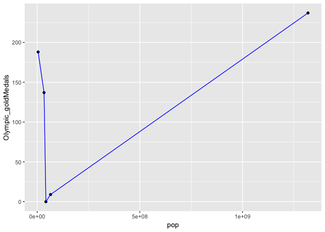

Hw04
================
Vetle Birkeland Huglen
4 10 2018

``` r
library(gapminder)
library(tidyverse)
```

    ## -- Attaching packages --------------------------------------------------- tidyverse 1.2.1 --

    ## <U+221A> ggplot2 3.0.0     <U+221A> purrr   0.2.4
    ## <U+221A> tibble  1.4.1     <U+221A> dplyr   0.7.4
    ## <U+221A> tidyr   0.8.0     <U+221A> stringr 1.2.0
    ## <U+221A> readr   1.1.1     <U+221A> forcats 0.3.0

    ## Warning: package 'ggplot2' was built under R version 3.4.4

    ## -- Conflicts ------------------------------------------------------ tidyverse_conflicts() --
    ## x dplyr::filter() masks stats::filter()
    ## x dplyr::lag()    masks stats::lag()

TASK 1 - TIDY DATA
------------------

Here follows a table and a graph visualising life expectancy by year in Norway, Canada and Sudan.

``` r
compareLifeExp <- gapminder %>% 
  select(year, country, lifeExp) %>%
  filter(country == 'Norway' | country == 'Canada' | country == 'Sudan') %>%
  group_by(year) %>%
  spread(key = country, value=lifeExp)
```

    ## Warning: package 'bindrcpp' was built under R version 3.4.4

``` r
knitr::kable(compareLifeExp)
```

|  year|  Canada|  Norway|   Sudan|
|-----:|-------:|-------:|-------:|
|  1952|  68.750|  72.670|  38.635|
|  1957|  69.960|  73.440|  39.624|
|  1962|  71.300|  73.470|  40.870|
|  1967|  72.130|  74.080|  42.858|
|  1972|  72.880|  74.340|  45.083|
|  1977|  74.210|  75.370|  47.800|
|  1982|  75.760|  75.970|  50.338|
|  1987|  76.860|  75.890|  51.744|
|  1992|  77.950|  77.320|  53.556|
|  1997|  78.610|  78.320|  55.373|
|  2002|  79.770|  79.050|  56.369|
|  2007|  80.653|  80.196|  58.556|

``` r
compareLifeExp %>%
  ggplot() +
  geom_point(aes(year, Norway), colour = 'Orange') +
  geom_point(aes(year, Canada), colour = 'Green') +
  geom_point(aes(year, Sudan), colour = 'Turquoise') +
  labs(y = "Life Expectancy")
```


Now lets look at the smallest life expectancy in each continent by year.

``` r
minLifeExp <- gapminder %>%
  group_by(year, continent) %>%
  summarise(min_lifeExp = min(lifeExp)) %>%
  spread(key = continent, value = min_lifeExp)
knitr::kable(minLifeExp)
```

|  year|  Africa|  Americas|    Asia|  Europe|  Oceania|
|-----:|-------:|---------:|-------:|-------:|--------:|
|  1952|  30.000|    37.579|  28.801|  43.585|   69.120|
|  1957|  31.570|    40.696|  30.332|  48.079|   70.260|
|  1962|  32.767|    43.428|  31.997|  52.098|   70.930|
|  1967|  34.113|    45.032|  34.020|  54.336|   71.100|
|  1972|  35.400|    46.714|  36.088|  57.005|   71.890|
|  1977|  36.788|    49.923|  31.220|  59.507|   72.220|
|  1982|  38.445|    51.461|  39.854|  61.036|   73.840|
|  1987|  39.906|    53.636|  40.822|  63.108|   74.320|
|  1992|  23.599|    55.089|  41.674|  66.146|   76.330|
|  1997|  36.087|    56.671|  41.763|  68.835|   77.550|
|  2002|  39.193|    58.137|  42.129|  70.845|   79.110|
|  2007|  39.613|    60.916|  43.828|  71.777|   80.204|

Like in the plot in the first task, this form makes it easy to make plots that compare the different continents, since we have already divided them into seperate features. Lets make a line plot to get some variety:

``` r
minLifeExp %>% 
  ggplot() +
  geom_line(aes(year, Africa), colour = 'red') +
  geom_line(aes(year, Asia), colour = 'green') +
  geom_line(aes(year, Europe), colour = 'purple') +
  geom_line(aes(year, Americas), colour = 'light blue') +
  geom_line(aes(year, Oceania), colour = 'orange') +
  labs(y = "Life Expectancy")
```


Here I'll create a new dataframe with some additional information about some selected countries, and join them to the year 2007 in gapminder, as that is roughly the same time as the olympic medal statistic is from:

``` r
more_data <- data_frame(country = c('Norway', 'Canada', 'Sudan', 'China', 'Thailand'), highest_peak = c(2469, 5956, 3042, 8848, 2565), Olympic_goldMedals = c(188, 137, 0, 237, 9))

joined_data <- gapminder %>%
  filter(year == 2007) %>%
  right_join(more_data, by = 'country')
```

    ## Warning: Column `country` joining factor and character vector, coercing
    ## into character vector

``` r
knitr::kable(joined_data)
```

| country  | continent |  year|  lifeExp|         pop|  gdpPercap|  highest\_peak|  Olympic\_goldMedals|
|:---------|:----------|-----:|--------:|-----------:|----------:|--------------:|--------------------:|
| Norway   | Europe    |  2007|   80.196|     4627926|  49357.190|           2469|                  188|
| Canada   | Americas  |  2007|   80.653|    33390141|  36319.235|           5956|                  137|
| Sudan    | Africa    |  2007|   58.556|    42292929|   2602.395|           3042|                    0|
| China    | Asia      |  2007|   72.961|  1318683096|   4959.115|           8848|                  237|
| Thailand | Asia      |  2007|   70.616|    65068149|   7458.396|           2565|                    9|

I can now check if there seems to be a correlation between the population in a country, and the number of olympic gold medals:

``` r
ggplot(joined_data, aes(pop, Olympic_goldMedals)) +
  geom_point() +
  geom_line(colour = 'blue')
```



There definitely does not seem to be a trend here!
